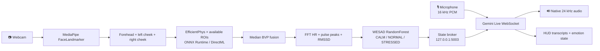

# WebPulse · Multimodal Affective Computing

<p align="center">
  
</p>

   

WebPulse is a local, real-time HCI research prototype for affect-aware interaction. It combines camera-based remote photoplethysmography (rPPG), HR/HRV features, a WESAD-trained stress classifier, voice valence, and a Gemini Live spoken companion. The system is designed for research and interaction prototyping; it is not a medical device and does not diagnose stress, emotion, or health conditions.

> 🟢 **Live path:** webcam → multi-ROI EfficientPhys → fused BVP → HR/HRV → WESAD → local broker → Gemini Live context → native audio response

## Research scope

The implementation is conceptually informed by the following work:

| Area | Reference | Design influence |
|---|---|---|
| Deep rPPG | Liu et al., [EfficientPhys, WACV 2023](https://openaccess.thecvf.com/content/WACV2023/html/Liu_EfficientPhys_Enabling_Simple_Fast_and_Accurate_Camera-Based_Cardiac_Measurement_WACV_2023_paper.html) and [rPPG-Toolbox, NeurIPS 2023](https://proceedings.neurips.cc/paper_files/paper/2023/hash/d7d0d548a6317407e02230f15ce75817-Abstract-Datasets_and_Benchmarks.html) | Lightweight remote cardiac-signal inference and evaluation framing. |
| HRV and stress | Schmidt et al., [WESAD, ICMI 2018](https://ubi29.informatik.uni-siegen.de/usi/data_wesad.html) | Three-class stress/affect framing and HRV feature use. |
| Physiological interaction | Ikeda, Horie, and Sugaya, [Estimating Emotion with Biological Information for Robot Interaction](https://doi.org/10.1016/j.procs.2017.08.198) | Mapping biological indices into an interaction-facing affect state. |
| Multimodal affect | Ziaratnia et al., [CCT-LSTM remote stress estimation, WACV 2024](https://openaccess.thecvf.com/content/WACV2024/html/Ziaratnia_Multimodal_Deep_Learning_for_Remote_Stress_Estimation_Using_CCT-LSTM_WACV_2024_paper.html) | Explicit modality separation and temporal-stability motivation. |
| Emotion representation | Russell, [A Circumplex Model of Affect](https://doi.org/10.1037/h0077714) | Arousal–valence fusion space. |

WebPulse does **not** reproduce CCT-LSTM, train on UBFC-Phys, or claim the reported paper results. It is a practical implementation using EfficientPhys, WESAD-derived HRV classification, voice features, and deterministic temporal stabilization.

## Architecture



The runtime uses three local processes:

| Process | Entry point | Responsibility |
|---|---|---|
| 1 · Vision | `python -m rppg.rppg_server` | Webcam, face landmarks, ROI quality, EfficientPhys, fused BVP, HR/HRV, WESAD, HUD. |
| 3 · Broker | `python state_broker.py` | Latest-only in-memory IPC. No disk polling or text-file synchronization. |
| 2 · Live agent | `python app.py` | Microphone, Gemini WebSocket, context injection, native audio playback, transcription, barge-in. |

### Minimal data path

```text
Webcam
  -> Face landmarks
  -> Forehead + both cheek ROIs
  -> EfficientPhys + median BVP fusion
  -> HR / HRV + WESAD stress state
  -> Local state broker
  -> 1-to-5 scored physiology context
  -> Gemini Live WebSocket
  -> Native audio response + HUD

Microphone ------------------------------------------------┘
```

The broker transports the latest physiological state locally. The Live agent is the
conversion boundary: it converts the current HR, HRV, arousal, valence, stress, signal
quality, and ROI coverage into labeled 1-to-5 context fields before sending them to the
conversation model. A fixed ten-entry, latest-first memory buffer holds these scored
snapshots; every new sample evicts the oldest one, and answer-time context uses the
newest entry. Raw sensor values remain local to the research pipeline.

## Vision and ROI implementation

### Face regions

[rppg/capture.py](rppg/capture.py) creates three independently quality-checked regions:

- `forehead`
- `left_cheek`
- `right_cheek`

MediaPipe landmarks define the regions; Haar geometry is available as a fallback. Each region carries its crop, bounding box, brightness, variance, and status. Crops remain raw until the model preprocessing stage so enhancement is not applied twice.

### EfficientPhys

[rppg/deep_engine.py](rppg/deep_engine.py) loads `weights/efficientphys.onnx` through ONNX Runtime. Verified model metadata on the target environment:

```text
Input:  video_frames ['num_frames', 3, 72, 72] float32
Output: bvp_pred    ['output_samples', 1] float32
Providers: DmlExecutionProvider, CPUExecutionProvider
```

The exported EfficientPhys model is a single-ROI temporal model. Therefore the implementation evaluates each currently usable facial region independently using its own temporal queue, then combines the resulting BVP predictions. It does not incorrectly change the ONNX input shape to mix unrelated regions.

Processing sequence:

1. Capture one raw crop per available ROI.
2. Clear a region’s queue when that region becomes unusable; stale samples are never reused.
3. Apply enhancement, RGB conversion, resize to 72×72, `[0,1]` scaling, and channel-first conversion once.
4. Run the EfficientPhys temporal model for each ready ROI.
5. Align available outputs and apply per-sample median fusion. With one available ROI, the median is that ROI; with two or three, it suppresses isolated regional artifacts.
6. Append the fused BVP to the temporal signal buffer.

Coverage policy:

| Coverage | Runtime behavior |
|---:|---|
| `3/3` | Full forehead and bilateral-cheek coverage; normal confidence policy. |
| `2/3` | Continue with the two available regions; mark `WEAK_SIGNAL`. |
| `1/3` | Continue with the one available region; mark `WEAK_SIGNAL`. |
| `0/3` | No new physiological estimate; mark `NO_VALID_ROI`. |

The camera log and HUD expose coverage as `ROIs: n/3` and `ROI coverage n/3`.

## HR/HRV and WESAD

[rppg/hrv.py](rppg/hrv.py) operates on the single fused BVP stream:

- FFT estimates HR in the configured physiological frequency range.
- Peak detection estimates beat intervals.
- RMSSD is calculated from valid successive inter-beat intervals.
- Arousal is bounded and smoothed over time.

[fusion/wesad_classifier.py](fusion/wesad_classifier.py) loads `fusion/models/wesad_hrv_classifier.pkl`. The trained feature vector is:

```text
[RMSSD (ms), estimated SDNN (ms), mean HR (BPM)]
```

WESAD receives HR/HRV computed from the same combined forehead/cheek BVP used for the HR display. It is not run separately on only the forehead or on an unrelated cheek signal. [fusion/emotion.py](fusion/emotion.py) adds a small temporal stabilizer so one isolated WESAD classification cannot cause a visible stress-state jump; sustained changes are accepted.

## Multimodal fusion and scored context

The body modality contains fused rPPG HR/HRV, WESAD stress/arousal, ROI coverage, and signal quality. The audio modality contains microphone-derived valence and the user's spoken turn. Fusion uses a Russell-style arousal–valence quadrant:

```text
low arousal  + positive valence = calm-positive
low arousal  + negative valence = calm-negative
high arousal + positive valence = aroused-positive
high arousal + negative valence = aroused-negative
```

Before Gemini receives physiology, [live_emotion_agent.py](live_emotion_agent.py) converts it into interpretable bounded scores:

- `bio_state_score_5`: 0 when unreliable, 1 very calm, 3 moderate, 5 high activation/stress;
- `wesad_stress_score_5`: CALM=1, NORMAL=3, STRESSED=5;
- `arousal_score_5`: normalized activation;
- `valence_score_5`: negative-to-positive voice tone;
- `hr_score_5`: bounded HR category score;
- `hrv_stress_load_5`: inverse HRV calmness/stress-load score;
- `signal_quality` and `roi_coverage`.

Raw BPM and RMSSD remain local processing values and are not sent in the model-facing Live context.

## Gemini Live implementation

[live_emotion_agent.py](live_emotion_agent.py) is the active audio/LLM path. It:

- loads `GEMINI_API_KEY` from `.env`;
- opens one persistent authenticated Gemini Live WebSocket;
- requests native `AUDIO` output with the configured prebuilt voice;
- streams mono, signed 16-bit, 16 kHz PCM through `realtimeInput`;
- injects physiological data through `clientContent` with `turnComplete: false`;
- sends context every two seconds and at speech start/end;
- routes incoming native PCM to a low-latency 24 kHz speaker queue;
- immediately clears the queue on `serverContent.interrupted` for barge-in;
- separates `inputTranscription` into `VOICE` and `outputTranscription` into `COMPANION`;
- logs completed turns to the existing session logger.

The legacy modules [llm/prompt.py](llm/prompt.py), [llm/transcribe.py](llm/transcribe.py), [llm/tts.py](llm/tts.py), and [audio/audio_server.py](audio/audio_server.py) remain compatibility/diagnostic code. They are not started by `app.py` and are not part of the active Live path.

## AMD Windows verification

The target conda environment was checked on the AMD Ryzen 7 7000-series integrated-graphics laptop:

```text
Python       3.11.15
OpenCV       4.11.0
MediaPipe    1.0.0
ONNX Runtime 1.24.4
DirectML     available and selected
sounddevice  0.5.5
websockets   16.1.1
```

DirectML is the intended acceleration route for the integrated AMD graphics device. CPU fallback remains available if DirectML initialization fails. This confirms backend availability; it does not constitute physiological accuracy validation. Accuracy still requires reference-sensor comparison and subject-independent evaluation.

## Installation and run

Create or activate the project environment and install [requirements.txt](requirements.txt):

```powershell
pip install -r requirements.txt
```

Create `.env`:

```text
GEMINI_API_KEY=your_key_here
GEMINI_LIVE_MODEL=gemini-3.1-flash-live-preview
GEMINI_LIVE_VOICE=Puck
RPPG_BACKEND=deep
```

Open three PowerShell terminals at the project root:

```powershell
# Terminal 1
python state_broker.py

# Terminal 2
python -m rppg.rppg_server

# Terminal 3
python app.py
```

Expected checks:

```text
[Deep rPPG] EfficientPhys execution: GPU (DirectML)
[rPPG Server (...)] ... | ROIs: 3/3
[State Broker] Broadcast state ...
[Live Agent] Gemini Live connected (..., Puck).
```

Press `q` in the camera window to stop Process 1. Use `RPPG_BACKEND=classical` only for diagnostic comparison; the active research path is EfficientPhys.

## Verification commands

```powershell
python -m py_compile live_emotion_agent.py rppg\capture.py rppg\deep_engine.py rppg\rppg_server.py rppg\hud.py fusion\emotion.py
python -m pytest -q test_fusion.py
```

The runtime smoke checks used for this version verified the ONNX input/output metadata, DirectML provider selection, Live setup payload, all-three-ROI inference, `WEAK_SIGNAL` behavior at partial coverage, and `NO_VALID_ROI` behavior at zero coverage.

## Proof of work

The following runtime captures document the working research prototype: live EfficientPhys inference, full three-region coverage, HR/HRV output, WESAD state classification, voice interaction, and Gemini Live responses.

### Calm state with good signal


Demonstrates `GOOD` signal quality, `3/3` ROI coverage, live HR/HRV values, a calm WESAD state, and a spoken emotion query with a companion response.

### Normal state with good signal


Demonstrates the same live pipeline under a changing normal physiological state while maintaining full forehead and bilateral-cheek coverage.

### Live emotion query


Demonstrates a natural-language question being transcribed in the Voice panel and answered in the Companion panel using the current physiological context.

## Limitations and research next steps

Lighting, motion, camera exposure, glasses reflections, landmark errors, skin-region visibility, and individual physiology affect rPPG quality. RMSSD is only meaningful when the fused pulse contains reliable beat peaks. The WESAD classifier is a research artifact and may require recalibration for a new population, task, camera, and environment.

For a research submission, report ROI coverage, signal-quality exclusions, HR error against a reference pulse sensor, and subject-independent WESAD evaluation. Future work may add a separately trained temporal model, but an untrained CCT-LSTM would not be scientifically valid or expected to improve this runtime.

<sub>🧪 Research prototype · ⚡ DirectML acceleration · 🎙 Live audio · ❤️ physiological context · 🔒 local IPC</sub>
