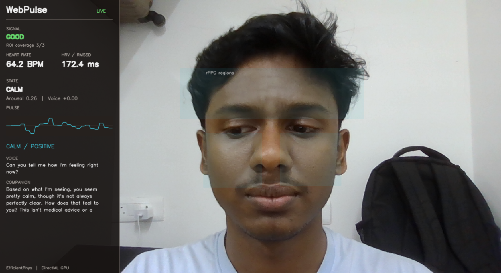
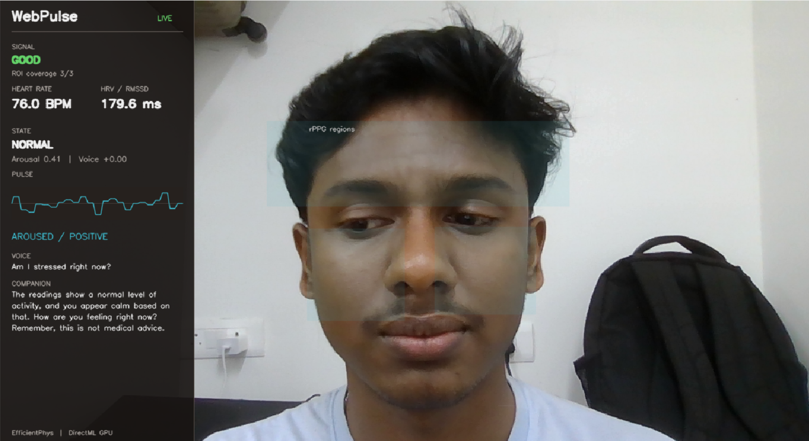
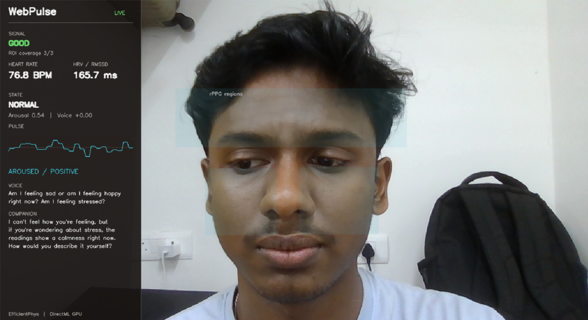
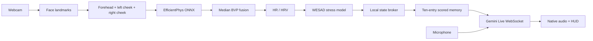

# WebPulse

<p align="center">
  
</p>

<p align="center">
  
  
  
  
  
  
</p>

WebPulse is a local HCI research prototype that estimates contactless physiology from a webcam and combines it with voice interaction. It processes forehead and bilateral-cheek regions with EfficientPhys, derives HR and HRV, classifies stress using a WESAD-trained model, converts the latest state into bounded 1-to-5 context scores, and provides a spoken Gemini Live companion.

It is a research prototype, not a medical device. It does not diagnose stress, emotion, or health conditions.

## **Future direction: privacy-preserving federated learning**

**The next major rework is a federated learning architecture for real-time deployment. The intended design keeps face video, rPPG signals, voice features, and personal biodata on the user's device. Only protected model updates would leave the device through secure aggregation, with optional differential privacy and encrypted transport. This reduces the need to centralize sensitive biometric data and makes the system more suitable for privacy-conscious HCI research and deployment.**

**Federated learning would also support collaborative model improvement across devices without collecting raw videos or physiological streams in a central server. Local evaluation, client sampling, aggregation, drift monitoring, and subject-independent validation would be used to improve generalization. Federated learning does not automatically prevent overfitting or underfitting; those risks still require careful data partitioning, regularization, privacy-budget management, and held-out validation.**

**EfficientPhys is used in the current implementation because it fits the available PC hardware and supports practical local inference. With stronger hardware, the architecture can be extended to higher-capacity 3D CNNs, PhysMamba, and other models available through the [rPPG-Toolbox](https://github.com/ubicomplab/rPPG-Toolbox), subject to latency, energy, and privacy evaluation.**

## Proof of work

These captures show the running application with live inference, `GOOD` signal quality, `3/3` ROI coverage, HR/HRV output, WESAD state labels, voice transcription, and Gemini responses.

### Calm state and full ROI coverage



### Normal state and full ROI coverage



### Live emotion query



## Architecture



The runtime is split into three local processes:

| Process | Command | Role |
|---|---|---|
| Vision | `python -m rppg.rppg_server` | Webcam, landmarks, ROI extraction, EfficientPhys, BVP fusion, HR/HRV, WESAD, HUD server. |
| Broker | `python state_broker.py` | Latest-only in-memory TCP IPC on `127.0.0.1:5003`. |
| Live agent | `python app.py` | Microphone, Gemini Live, scored context, audio playback, transcripts, and interruption handling. |

## Physiology pipeline

1. MediaPipe identifies the forehead, left cheek, and right cheek.
2. Each available region is quality-checked and passed through EfficientPhys.
3. Region-level BVP predictions are median-fused to reduce local noise.
4. The fused pulse produces HR, peak-based RMSSD, arousal, and signal quality.
5. The WESAD HRV classifier produces `CALM`, `NORMAL`, or `STRESSED`.

Partial coverage continues with the available regions and is marked `WEAK_SIGNAL`. With no usable region, the system reports `NO_VALID_ROI` instead of inventing a new physiological estimate.

## Scored context and temporary memory

The broker carries raw local state. The Live agent converts it into model-facing labels:

| Field | Meaning |
|---|---|
| `wesad_stress_score_5` | `1` calm, `3` normal, `5` stressed. |
| `arousal_score_5` | `1` low activation to `5` high activation. |
| `valence_score_5` | `1` negative to `5` positive. |
| `hr_score_5` | Bounded heart-rate category. |
| `hrv_stress_load_5` | Inverse HRV calmness/stress-load score. |
| `signal_quality` / `roi_coverage` | Reliability context for interpretation. |

`live_emotion_agent.py` maintains a fixed `deque(maxlen=10)`. At most one scored state is added per second. When the eleventh state arrives, the oldest state is discarded. At speech start and speech end, the agent reads the newest scored state and sends it as incomplete context, so physiology updates do not create unsolicited model turns.

## Gemini Live behavior

- Persistent bidirectional WebSocket for microphone input and native audio output.
- 16 kHz PCM microphone input and 24 kHz speaker output.
- `clientContent` with `turnComplete: false` for answer-time physiology context.
- User audio is the only generation trigger; idle telemetry is retained locally.
- Speaker playback is filtered from microphone forwarding, while genuine speech can barge in and clear the playback queue.
- The system prompt treats the scores as uncertain research context and avoids medical claims.

## Research basis

The implementation is informed by the following work:

- [rPPG-Toolbox: Deep Remote PPG Toolbox](https://github.com/ubicomplab/rPPG-Toolbox), NeurIPS 2023. This project follows the same research concern for reproducible camera-based physiological sensing, but uses its own EfficientPhys ONNX runtime and ROI pipeline rather than claiming to reproduce the toolbox.
- [rPPG-Toolbox paper](https://arxiv.org/abs/2210.00716), for benchmark-oriented remote PPG methodology and evaluation framing.
- [EfficientPhys](https://arxiv.org/abs/2207.04850), for efficient spatio-temporal remote PPG estimation.
- [WESAD dataset](https://ubicomp.eti.uni-siegen.de/home/datasets/icmi2018/), for stress-related physiological classification.
- [A Circumplex Model of Affect](https://doi.org/10.1037/h0077714), for arousal-valence representation.

WebPulse does not reproduce CCT-LSTM, claim paper-level benchmark performance, or replace subject-independent evaluation with live screenshots.

## Installation and run

Create a Python environment and install the project dependencies:

```powershell
pip install -r requirements.txt
```

Create `.env` with:

```text
GEMINI_API_KEY=your_key_here
GEMINI_LIVE_MODEL=gemini-3.1-flash-live-preview
GEMINI_LIVE_VOICE=Puck
RPPG_BACKEND=deep
```

Open three PowerShell terminals in the project root:

```powershell
# Terminal 1
python state_broker.py

# Terminal 2
python -m rppg.rppg_server

# Terminal 3
python app.py
```

Expected runtime indicators include `EfficientPhys execution: GPU (DirectML)`, `ROIs: 3/3`, broker broadcasts, and `Gemini Live connected`.

## Verification

```powershell
python -m py_compile live_emotion_agent.py rppg\capture.py rppg\deep_engine.py rppg\rppg_server.py rppg\hud.py fusion\emotion.py
python -m unittest test_fusion.py
```

The checked runtime path verifies ONNX metadata, DirectML selection, three-ROI inference, partial-coverage behavior, zero-coverage behavior, scored context bounds, ten-entry memory eviction, and answer-time context serialization.

## Limitations

Lighting, motion, exposure, glasses reflections, landmark errors, skin visibility, and individual physiology affect rPPG quality. RMSSD is meaningful only when the fused pulse has reliable peaks. The WESAD classifier may require recalibration for a new population, task, camera, and environment.

For a research submission, report ROI coverage, signal exclusions, HR error against a reference sensor, latency, and subject-independent WESAD evaluation.

<p align="center">
  
  
  
</p>
